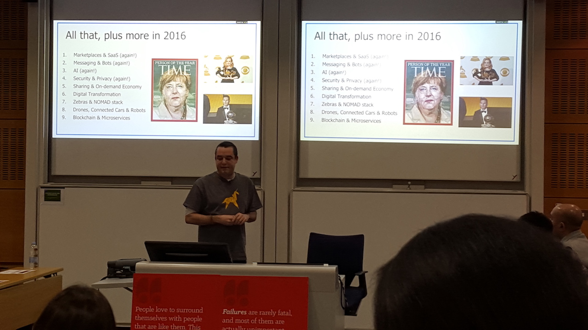
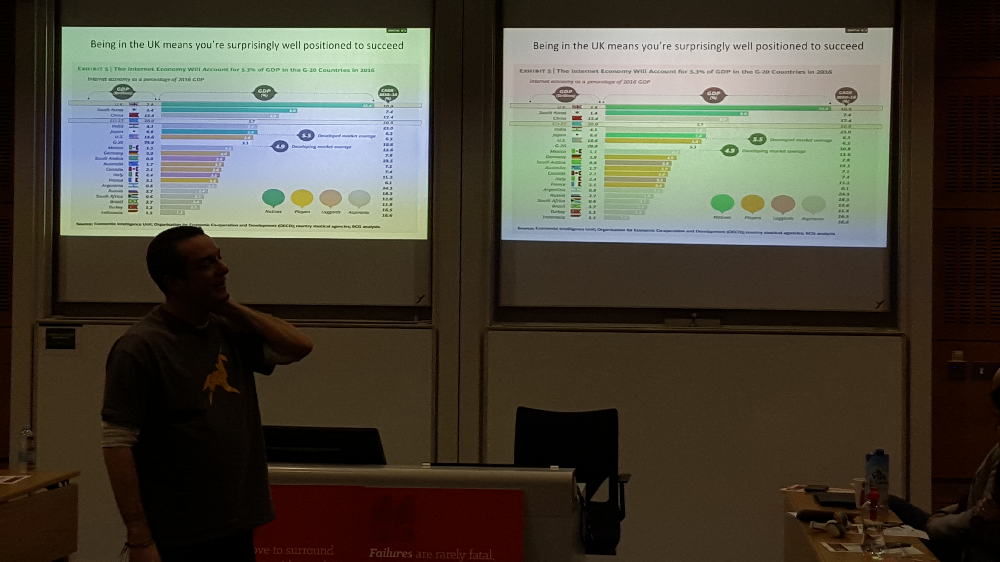
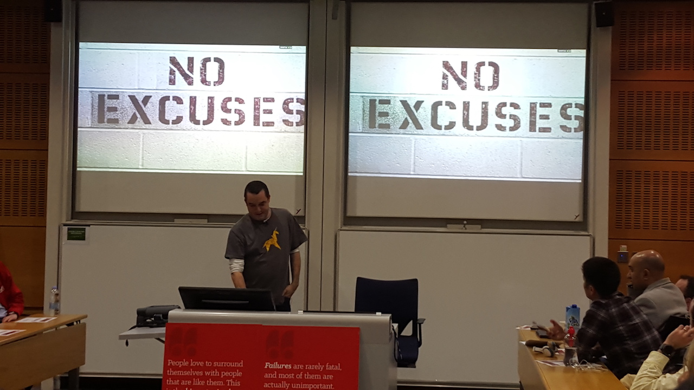

It's very inspiring to listen to someone who lives in a bigger world than you do. Someone who has a very optimistic outlook on the future.

It makes you feel safer and more confident that your opporunity to win is waiting for you ahead. You just need to work on it.

Hard.

Here is what I've learnt from today's event at <a href="http://tellseries.com/ai1ec_event/saul-klein-index-ventures-seedcamp-lovefilm" target="_blank">London Business School</a> where Saul Klein shared his life story:

+ `Investors pick surfers not waves.`
+ You've got to have a strong narrative. `Be a great storyteller`. Silicon Valley is better at it than the UK. UK startups can have more substance, but US startups will win because they tell better story and secure more funding.
+ Silicon Valley is decades ahead of Europe.
+ `If you need a job you can start a company`.
+ It's almost impossible to time the market.

### Clickable slides from the event:

1.

2.

3.

4.

5.

6.

7.

If you haven't been to one of the <a href="http://tellseries.com/" target="_blank">TELL Series</a> events at London Business School - I recommend it.

One fact that caught my attention: more than half of the audience attended such event for the first time. And more than half of the audience were London Business School students.

So glad that these events are open to general public.